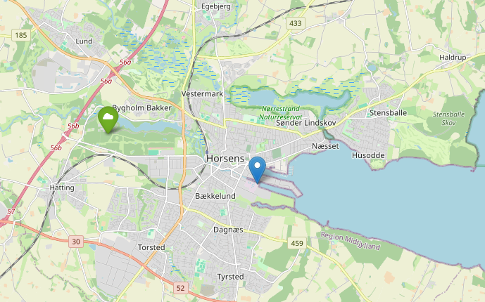

# Inflow from a waster water treatment plant

This repository provides access to measurements of the water inflow to a waster water treatment plant (WWTP). The data is accompanied by observations of relevant climate variables near the WWTP.

## Location

The location of the WWTP (blue) and weather station (green) have been marked in the following figure: 

## Intended use

The dataset is aimed at supporting educational, research, and exploratory activities, such as:

- Experimenting with time series models for forecasting
- [...]

## Details

The WWTP is located in Horsens, DK.

### Data description

The dataset contains the following variables; all variables have been measured at hourly resolution.

| label | Description | Units | Provider |
| --- | --- | --- | --- |
| inflow | Inflow of WWTP | m^3/h | TwinPlant |
| acc_precip | Accumulated precipitation | mm | DMI |
| mean_pressure | Mean pressure | hPa | DMI |
| mean_radiation | Mean radiation (spectral range: 305-2800nm) | W/m^2 | DMI |
| mean_relative_hum | Mean relative humidity | % | DMI |
| mean_temp | Mean air temperature | °C | DMI |
| temp_grass | Temperature at grass height | °C | DMI |
| temp_soil_10 | Temperature at 10 cm underground | °C | DMI |
| temp_soil_30 | Temperature at 30 cm underground |  °C| DMI |

## Usage rights

DMI's free data is subject to the Creative Commons license CC BY. You can read more about the license terms [here](https://www.dmi.dk/friedata/guides-til-frie-data/vilkar-for-brug-af-data), but in short:

    You are free to:

    - Parts — copy and redistribute the material in any media or format for all purposes, including commercial.
    - Adapt — remix, modify and build on the material for all purposes, including commercial ones.
    - The Licensor may not revoke the freedoms as long as you follow the license terms.

    Under the following conditions:

    - Crediting - You must provide appropriate credit , provide a link to the license, and provide information on whether any changes have been made . You must do so in any sensible way, but not in a way that suggests that the licensor approves you or your use.
    - No additional restrictions - You may not add legal terms or technological measures that legally restrict others from doing what the license allows.